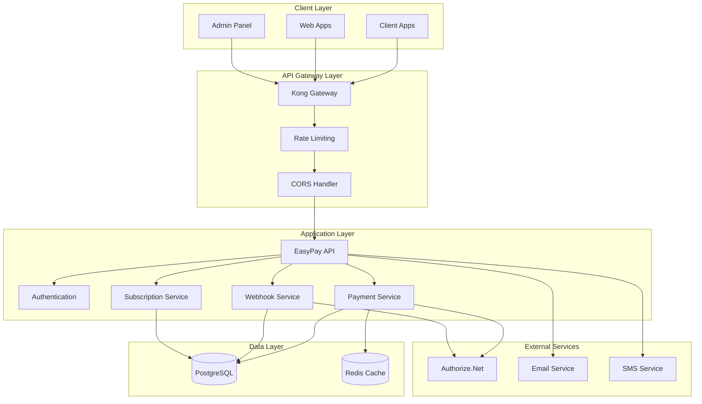
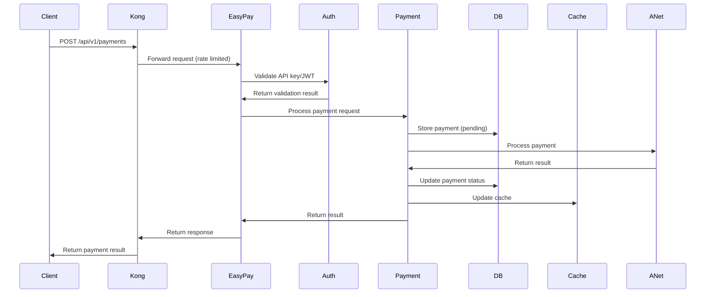
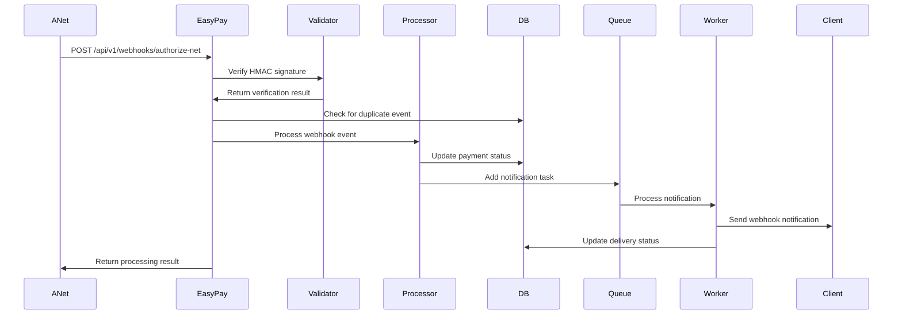
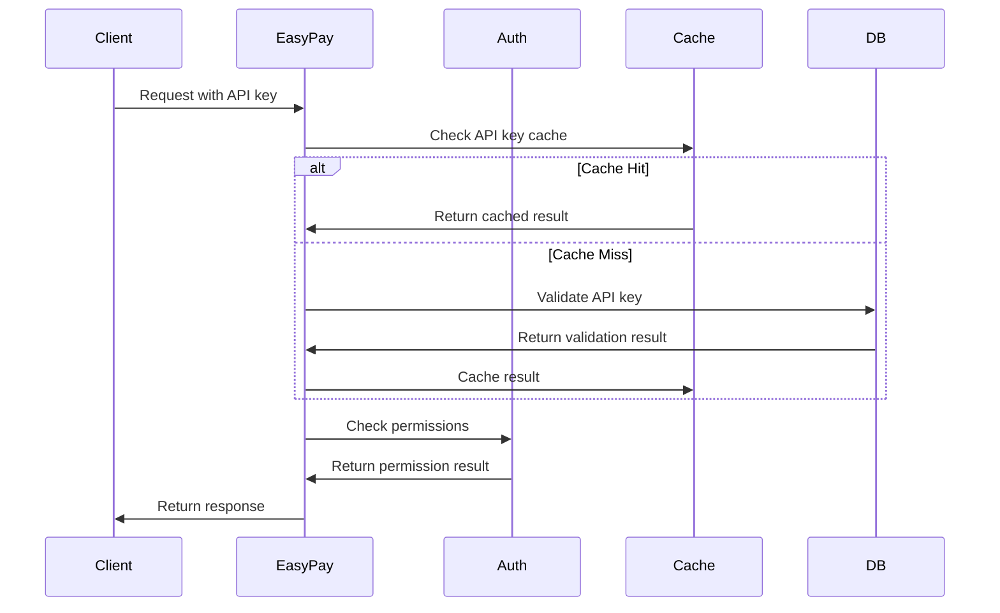
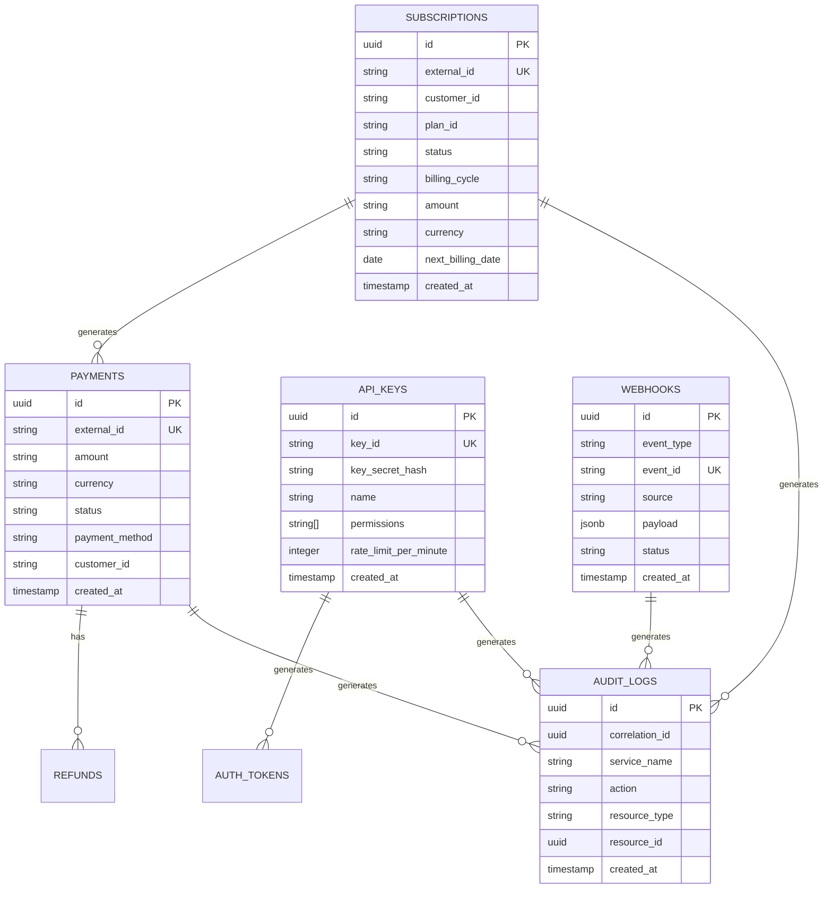
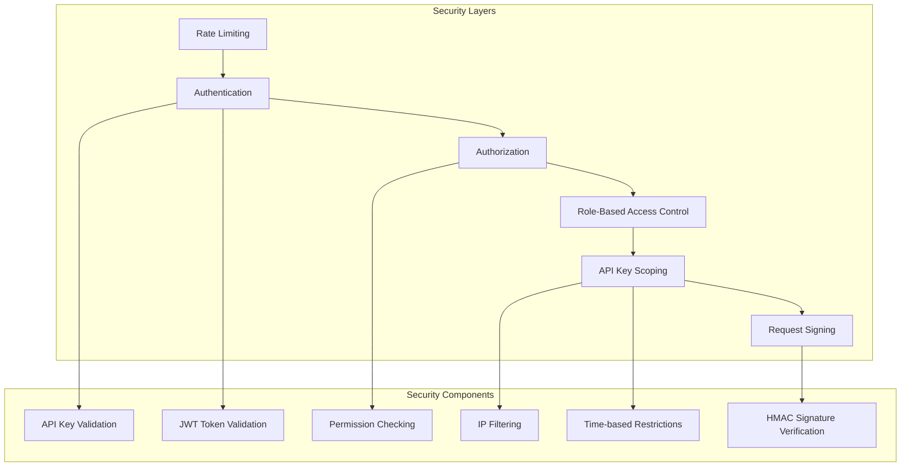
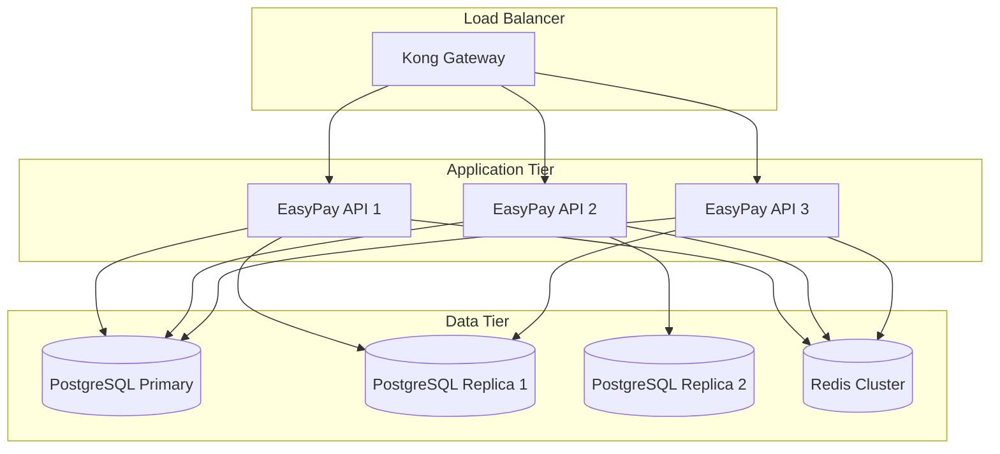
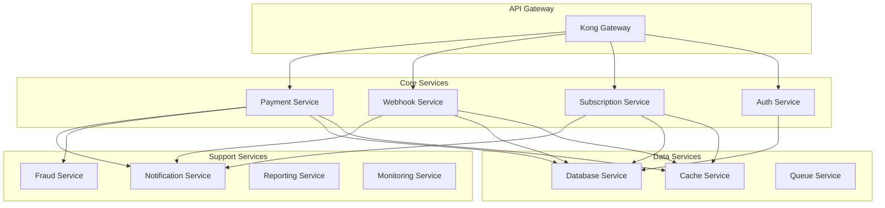

# EasyPay Payment Gateway - Architecture Documentation

This document provides a comprehensive overview of the EasyPay Payment Gateway system architecture, including API endpoints, data flows, database schema, and design trade-offs.

## 🏗️ System Architecture Overview

### High-Level Architecture



### Component Responsibilities

| Component | Responsibility |
|-----------|----------------|
| **Kong Gateway** | Rate limiting, CORS, SSL termination, load balancing |
| **EasyPay API** | Business logic, request processing, response formatting |
| **Authentication** | API key validation, JWT token management, RBAC |
| **Payment Service** | Payment processing, transaction management |
| **Webhook Service** | Webhook processing, event handling, retry logic |
| **Subscription Service** | Recurring billing, subscription management |
| **PostgreSQL** | Primary data storage, ACID transactions |
| **Redis** | Caching, session storage, rate limiting counters |
| **Authorize.Net** | Payment processor integration |

## 🔌 API Endpoints

### Core Payment Endpoints

#### Payment Processing

```http
POST   /api/v1/payments                    # Create payment (purchase)
GET    /api/v1/payments/{id}               # Get payment details
PUT    /api/v1/payments/{id}               # Update payment
POST   /api/v1/payments/{id}/capture       # Capture authorized payment
POST   /api/v1/payments/{id}/refund        # Refund payment (full/partial)
POST   /api/v1/payments/{id}/cancel        # Cancel payment (void)
GET    /api/v1/payments                    # List payments with filtering
```

#### Payment Request/Response Schema

**Create Payment Request:**
```json
{
  "amount": "25.99",
  "currency": "USD",
  "payment_method": "credit_card",
  "customer_id": "cust_123456789",
  "customer_email": "customer@example.com",
  "customer_name": "John Doe",
  "card_token": "tok_visa_4242",
  "description": "Premium subscription payment",
  "metadata": {
    "order_id": "order_2024_001",
    "product": "premium_plan"
  },
  "is_test": true
}
```

**Payment Response:**
```json
{
  "data": {
    "id": "550e8400-e29b-41d4-a716-446655440000",
    "external_id": "pay_2024_001",
    "amount": "25.99",
    "currency": "USD",
    "status": "captured",
    "payment_method": "credit_card",
    "customer_id": "cust_123456789",
    "customer_email": "customer@example.com",
    "customer_name": "John Doe",
    "card_last_four": "4242",
    "card_brand": "visa",
    "description": "Premium subscription payment",
    "metadata": {
      "order_id": "order_2024_001",
      "product": "premium_plan"
    },
    "processor_response_code": "1",
    "processor_response_message": "This transaction has been approved",
    "processor_transaction_id": "1234567890",
    "refunded_amount": "0.00",
    "refund_count": 0,
    "created_at": "2024-01-01T12:00:00Z",
    "updated_at": "2024-01-01T12:00:05Z",
    "processed_at": "2024-01-01T12:00:05Z",
    "settled_at": "2024-01-02T08:00:00Z",
    "is_test": true
  },
  "request_id": "req_123456789",
  "timestamp": "2024-01-01T12:00:05Z"
}
```

### Authentication Endpoints

#### API Key Management

```http
POST   /api/v1/auth/api-keys               # Create API key
GET    /api/v1/auth/api-keys               # List API keys
GET    /api/v1/auth/api-keys/{id}          # Get API key details
PUT    /api/v1/auth/api-keys/{id}          # Update API key
DELETE /api/v1/auth/api-keys/{id}          # Delete API key
```

#### JWT Token Management

```http
POST   /api/v1/auth/tokens                 # Generate JWT tokens
POST   /api/v1/auth/tokens/refresh         # Refresh tokens
POST   /api/v1/auth/tokens/validate        # Validate token
POST   /api/v1/auth/tokens/revoke          # Revoke token
```

#### Permission Management

```http
POST   /api/v1/auth/permissions/check      # Check permissions
GET    /api/v1/auth/me                     # Get current user info
POST   /api/v1/auth/cleanup                # Cleanup expired tokens
```

### Webhook Endpoints

#### Webhook Management

```http
GET    /api/v1/webhooks                    # List webhooks
POST   /api/v1/webhooks                    # Create webhook
GET    /api/v1/webhooks/{id}               # Get webhook details
PUT    /api/v1/webhooks/{id}               # Update webhook
DELETE /api/v1/webhooks/{id}               # Delete webhook
```

#### Webhook Reception

```http
POST   /api/v1/webhooks/authorize-net     # Authorize.Net webhook endpoint
POST   /api/v1/webhooks/authorize-net/test # Test webhook endpoint
GET    /api/v1/webhooks/authorize-net/events # Supported events
POST   /api/v1/webhooks/authorize-net/replay/{webhook_id} # Replay webhook
```

### Subscription Endpoints

```http
POST   /api/v1/subscriptions               # Create subscription
GET    /api/v1/subscriptions               # List subscriptions
GET    /api/v1/subscriptions/{id}          # Get subscription details
PUT    /api/v1/subscriptions/{id}          # Update subscription
DELETE /api/v1/subscriptions/{id}          # Cancel subscription
POST   /api/v1/subscriptions/{id}/pause    # Pause subscription
POST   /api/v1/subscriptions/{id}/resume  # Resume subscription
```

### System Endpoints

```http
GET    /health                             # Basic health check
GET    /health/ready                       # Readiness probe
GET    /health/live                        # Liveness probe
GET    /health/detailed                    # Detailed health check
GET    /metrics                            # Prometheus metrics
GET    /api/v1/version                     # API version info
```

## 🔄 Data Flow Diagrams

### Payment Processing Flow



### Webhook Processing Flow



### Authentication Flow



## 🗄️ Database Schema

### Core Tables

#### Payments Table

```sql
CREATE TABLE payments (
    id UUID PRIMARY KEY DEFAULT gen_random_uuid(),
    external_id VARCHAR(255) UNIQUE NOT NULL,
    amount VARCHAR(20) NOT NULL,
    currency VARCHAR(3) NOT NULL,
    status VARCHAR(50) NOT NULL DEFAULT 'pending',
    payment_method VARCHAR(50) NOT NULL,
    customer_id VARCHAR(255),
    customer_email VARCHAR(255),
    customer_name VARCHAR(255),
    card_last_four VARCHAR(4),
    card_brand VARCHAR(50),
    description TEXT,
    metadata JSONB,
    processor_response_code VARCHAR(10),
    processor_response_message TEXT,
    processor_transaction_id VARCHAR(255),
    refunded_amount VARCHAR(20) DEFAULT '0.00',
    refund_count INTEGER DEFAULT 0,
    created_at TIMESTAMP WITH TIME ZONE DEFAULT NOW(),
    updated_at TIMESTAMP WITH TIME ZONE DEFAULT NOW(),
    processed_at TIMESTAMP WITH TIME ZONE,
    settled_at TIMESTAMP WITH TIME ZONE,
    is_test BOOLEAN DEFAULT FALSE,
    
    -- Indexes
    INDEX idx_payments_external_id (external_id),
    INDEX idx_payments_status (status),
    INDEX idx_payments_customer_id (customer_id),
    INDEX idx_payments_created_at (created_at),
    INDEX idx_payments_processor_transaction_id (processor_transaction_id)
);
```

#### API Keys Table

```sql
CREATE TABLE api_keys (
    id UUID PRIMARY KEY DEFAULT gen_random_uuid(),
    key_id VARCHAR(255) UNIQUE NOT NULL,
    key_secret_hash VARCHAR(255) NOT NULL,
    name VARCHAR(255) NOT NULL,
    description TEXT,
    permissions TEXT[] NOT NULL DEFAULT '{}',
    rate_limit_per_minute INTEGER DEFAULT 100,
    rate_limit_per_hour INTEGER DEFAULT 1000,
    rate_limit_per_day INTEGER DEFAULT 10000,
    ip_whitelist TEXT[],
    ip_blacklist TEXT[],
    expires_at TIMESTAMP WITH TIME ZONE,
    last_used_at TIMESTAMP WITH TIME ZONE,
    usage_count INTEGER DEFAULT 0,
    status VARCHAR(20) DEFAULT 'active',
    created_at TIMESTAMP WITH TIME ZONE DEFAULT NOW(),
    updated_at TIMESTAMP WITH TIME ZONE DEFAULT NOW(),
    
    -- Indexes
    INDEX idx_api_keys_key_id (key_id),
    INDEX idx_api_keys_status (status),
    INDEX idx_api_keys_created_at (created_at)
);
```

#### Webhooks Table

```sql
CREATE TABLE webhooks (
    id UUID PRIMARY KEY DEFAULT gen_random_uuid(),
    event_type VARCHAR(100) NOT NULL,
    event_id VARCHAR(255) UNIQUE NOT NULL,
    source VARCHAR(50) NOT NULL,
    payload JSONB NOT NULL,
    signature VARCHAR(255),
    processed_at TIMESTAMP WITH TIME ZONE,
    status VARCHAR(20) DEFAULT 'pending',
    retry_count INTEGER DEFAULT 0,
    error_message TEXT,
    metadata JSONB,
    created_at TIMESTAMP WITH TIME ZONE DEFAULT NOW(),
    updated_at TIMESTAMP WITH TIME ZONE DEFAULT NOW(),
    
    -- Indexes
    INDEX idx_webhooks_event_id (event_id),
    INDEX idx_webhooks_event_type (event_type),
    INDEX idx_webhooks_status (status),
    INDEX idx_webhooks_created_at (created_at)
);
```

#### Subscriptions Table

```sql
CREATE TABLE subscriptions (
    id UUID PRIMARY KEY DEFAULT gen_random_uuid(),
    external_id VARCHAR(255) UNIQUE NOT NULL,
    customer_id VARCHAR(255) NOT NULL,
    plan_id VARCHAR(255) NOT NULL,
    status VARCHAR(50) NOT NULL DEFAULT 'active',
    billing_cycle VARCHAR(20) NOT NULL,
    amount VARCHAR(20) NOT NULL,
    currency VARCHAR(3) NOT NULL,
    next_billing_date DATE,
    payment_method JSONB NOT NULL,
    metadata JSONB,
    created_at TIMESTAMP WITH TIME ZONE DEFAULT NOW(),
    updated_at TIMESTAMP WITH TIME ZONE DEFAULT NOW(),
    
    -- Indexes
    INDEX idx_subscriptions_external_id (external_id),
    INDEX idx_subscriptions_customer_id (customer_id),
    INDEX idx_subscriptions_status (status),
    INDEX idx_subscriptions_next_billing_date (next_billing_date)
);
```

#### Audit Logs Table

```sql
CREATE TABLE audit_logs (
    id UUID PRIMARY KEY DEFAULT gen_random_uuid(),
    correlation_id UUID NOT NULL,
    service_name VARCHAR(50) NOT NULL,
    action VARCHAR(50) NOT NULL,
    resource_type VARCHAR(50) NOT NULL,
    resource_id UUID,
    user_id UUID,
    ip_address INET,
    user_agent TEXT,
    request_data JSONB,
    response_data JSONB,
    status_code INTEGER,
    duration_ms INTEGER,
    created_at TIMESTAMP WITH TIME ZONE DEFAULT NOW(),
    
    -- Indexes
    INDEX idx_audit_logs_correlation_id (correlation_id),
    INDEX idx_audit_logs_service_name (service_name),
    INDEX idx_audit_logs_created_at (created_at),
    INDEX idx_audit_logs_resource_type (resource_type)
);
```

### Entity Relationships



## ⚖️ Design Trade-offs

### 1. Synchronous vs Asynchronous Processing

**Decision**: Hybrid approach with synchronous API responses and asynchronous background processing

**Trade-offs**:
- ✅ **Pros**: Fast API responses, reliable background processing, better user experience
- ❌ **Cons**: Increased complexity, eventual consistency challenges
- **Rationale**: Payment processing requires immediate feedback, but webhook delivery and notifications can be asynchronous

**Implementation**:
```python
# Synchronous payment processing
async def create_payment(payment_data):
    # Immediate processing and response
    result = await process_payment(payment_data)
    return result

# Asynchronous webhook processing
async def process_webhook_async(webhook_data):
    # Background processing
    await webhook_queue.enqueue(webhook_data)
```

### 2. Database vs Cache Strategy

**Decision**: Multi-level caching with Redis and database fallback

**Trade-offs**:
- ✅ **Pros**: Fast read performance, reduced database load, high availability
- ❌ **Cons**: Cache invalidation complexity, potential data inconsistency
- **Rationale**: Payment data requires consistency, but API responses can be cached

**Implementation**:
```python
# Cache-aside pattern
async def get_payment(payment_id):
    # Try cache first
    cached = await cache.get(f"payment:{payment_id}")
    if cached:
        return cached
    
    # Fallback to database
    payment = await db.get_payment(payment_id)
    await cache.set(f"payment:{payment_id}", payment, ttl=300)
    return payment
```

### 3. Monolithic vs Microservices Architecture

**Decision**: Modular monolith with microservices-ready design

**Trade-offs**:
- ✅ **Pros**: Simpler deployment, easier debugging, shared data consistency
- ❌ **Cons**: Single point of failure, harder to scale individual components
- **Rationale**: Start simple, evolve to microservices as needed

**Implementation**:
```python
# Modular design with clear boundaries
class PaymentService:
    def __init__(self, repository, cache, external_client):
        self.repository = repository
        self.cache = cache
        self.external_client = external_client
```

### 4. Error Handling Strategy

**Decision**: Comprehensive error handling with retry mechanisms and dead letter queues

**Trade-offs**:
- ✅ **Pros**: High reliability, automatic recovery, detailed error tracking
- ❌ **Cons**: Increased complexity, potential for infinite retry loops
- **Rationale**: Payment processing requires high reliability and error recovery

**Implementation**:
```python
# Circuit breaker pattern
@circuit_breaker(failure_threshold=5, timeout=60)
async def call_external_api(data):
    try:
        return await external_client.process(data)
    except Exception as e:
        await dead_letter_queue.enqueue(data, error=str(e))
        raise
```

### 5. Authentication Strategy

**Decision**: Dual authentication with API keys and JWT tokens

**Trade-offs**:
- ✅ **Pros**: Flexible authentication, stateless JWT, secure API keys
- ❌ **Cons**: Increased complexity, multiple authentication flows
- **Rationale**: Different use cases require different authentication methods

**Implementation**:
```python
# API Key authentication for server-to-server
async def authenticate_api_key(key_id, key_secret):
    api_key = await get_api_key(key_id)
    return verify_secret(key_secret, api_key.secret_hash)

# JWT authentication for web applications
async def authenticate_jwt(token):
    payload = jwt.decode(token, SECRET_KEY, algorithms=["HS256"])
    return payload
```

### 6. Rate Limiting Strategy

**Decision**: Multi-level rate limiting with Kong gateway and application-level controls

**Trade-offs**:
- ✅ **Pros**: Protection against abuse, configurable limits, distributed protection
- ❌ **Cons**: Additional complexity, potential for false positives
- **Rationale**: Payment APIs need protection against abuse and DDoS attacks

**Implementation**:
```python
# Kong gateway rate limiting
rate_limit:
  minute: 100
  hour: 1000
  day: 10000

# Application-level rate limiting
@rate_limit(requests=100, per=60)
async def create_payment():
    # Payment processing logic
```

## 🔒 Security Architecture

### Authentication & Authorization

#### Multi-Layer Security



#### Security Headers

```python
SECURITY_HEADERS = {
    "X-Content-Type-Options": "nosniff",
    "X-Frame-Options": "DENY",
    "X-XSS-Protection": "1; mode=block",
    "Strict-Transport-Security": "max-age=31536000",
    "Content-Security-Policy": "default-src 'self'",
    "Referrer-Policy": "strict-origin-when-cross-origin",
    "Permissions-Policy": "geolocation=(), microphone=(), camera=()"
}
```

### Data Protection

#### Encryption Strategy

- **In Transit**: TLS 1.3 for all communications
- **At Rest**: AES-256 encryption for database
- **Secrets**: Environment variables with secure key management
- **Tokens**: JWT with secure signing keys

#### PCI DSS Compliance

- **Card Data**: Never stored, tokenized when needed
- **Network Security**: Secure network architecture
- **Access Control**: Strict access controls and monitoring
- **Audit Logging**: Comprehensive audit trail

## 📊 Performance Considerations

### Scalability Design

#### Horizontal Scaling



#### Caching Strategy

- **L1 Cache**: In-memory application cache
- **L2 Cache**: Redis distributed cache
- **Database**: Connection pooling and query optimization
- **CDN**: Static content delivery

### Performance Metrics

#### Key Performance Indicators

- **Response Time**: < 200ms for 95th percentile
- **Throughput**: 1000+ requests/second
- **Availability**: 99.9% uptime
- **Error Rate**: < 0.1% error rate

#### Monitoring Strategy

- **Real-time Metrics**: Prometheus + Grafana
- **Distributed Tracing**: Correlation IDs
- **Performance Monitoring**: Custom metrics
- **Alerting**: Proactive issue detection

## 🔄 Compliance Considerations

### Regulatory Compliance

#### PCI DSS Requirements

- **Level 1 Compliance**: Secure network architecture
- **Data Protection**: Encryption and tokenization
- **Access Control**: Multi-factor authentication
- **Monitoring**: Continuous security monitoring
- **Testing**: Regular security assessments

#### GDPR Compliance

- **Data Minimization**: Only collect necessary data
- **Consent Management**: Clear consent mechanisms
- **Right to Erasure**: Data deletion capabilities
- **Data Portability**: Export functionality
- **Privacy by Design**: Built-in privacy protection

### Audit Trail

#### Comprehensive Logging

```python
# Audit log entry
audit_log = {
    "correlation_id": "req_123456789",
    "service_name": "payment_service",
    "action": "create_payment",
    "resource_type": "payment",
    "resource_id": "pay_123456789",
    "user_id": "user_123456789",
    "ip_address": "192.168.1.100",
    "request_data": {...},
    "response_data": {...},
    "status_code": 200,
    "duration_ms": 150,
    "timestamp": "2024-01-01T12:00:00Z"
}
```

## 🚀 Future Architecture Evolution

### Planned Enhancements

#### Microservices Migration



#### Advanced Features

1. **Machine Learning**: Fraud detection algorithms
2. **Real-time Analytics**: Stream processing
3. **Multi-Region**: Global deployment
4. **Blockchain Integration**: Cryptocurrency support
5. **Advanced Monitoring**: Distributed tracing with Jaeger

### Technology Roadmap

#### Short Term (3 months)
- Performance optimization
- Security hardening
- Monitoring enhancement

#### Medium Term (6 months)
- Kubernetes migration
- Service mesh integration
- Advanced monitoring

#### Long Term (12 months)
- Multi-region deployment
- AI/ML integration
- Blockchain support

---

This architecture provides a solid foundation for building a scalable, secure, and maintainable payment processing system. The design balances simplicity with flexibility, allowing for future evolution while maintaining high performance and reliability standards.
