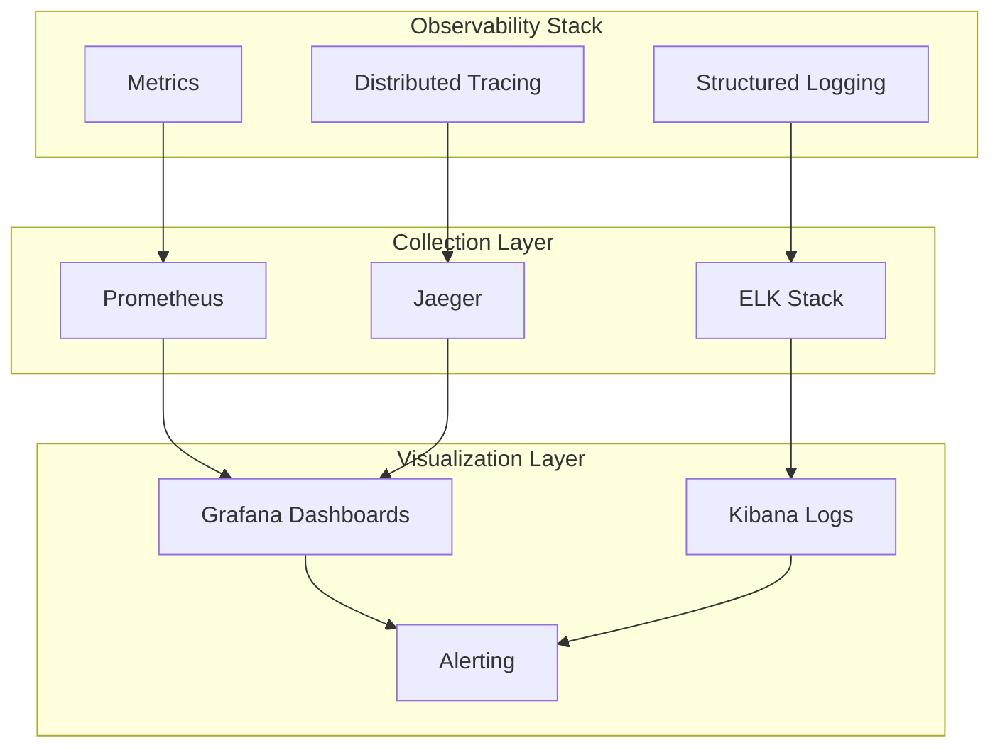

# EasyPay Payment Gateway - Observability Documentation

This document provides a comprehensive overview of the observability strategy for the EasyPay Payment Gateway, including metrics collection, distributed tracing, logging, and monitoring capabilities.

## 📊 Observability Overview

### Three Pillars of Observability



## 📈 Metrics Collection

### Prometheus Metrics

#### HTTP Request Metrics

```python
# Request count metric
REQUEST_COUNT = Counter(
    'easypay_http_requests_total',
    'Total HTTP requests',
    ['method', 'endpoint', 'status_code']
)

# Request duration metric
REQUEST_DURATION = Histogram(
    'easypay_http_request_duration_seconds',
    'HTTP request duration',
    ['method', 'endpoint'],
    buckets=[0.1, 0.25, 0.5, 1.0, 2.5, 5.0, 10.0]
)

# Request size metric
REQUEST_SIZE = Histogram(
    'easypay_http_request_size_bytes',
    'HTTP request size',
    ['method', 'endpoint'],
    buckets=[100, 1000, 10000, 100000, 1000000]
)

# Response size metric
RESPONSE_SIZE = Histogram(
    'easypay_http_response_size_bytes',
    'HTTP response size',
    ['method', 'endpoint'],
    buckets=[100, 1000, 10000, 100000, 1000000]
)
```

#### Payment Processing Metrics

```python
# Payment count metrics
PAYMENT_COUNT = Counter(
    'easypay_payments_total',
    'Total payments processed',
    ['status', 'currency', 'payment_method']
)

# Payment amount metrics
PAYMENT_AMOUNT = Histogram(
    'easypay_payment_amount',
    'Payment amounts',
    ['currency'],
    buckets=[1, 10, 50, 100, 500, 1000, 5000, 10000]
)

# Payment processing time
PAYMENT_DURATION = Histogram(
    'easypay_payment_duration_seconds',
    'Payment processing duration',
    ['status'],
    buckets=[0.1, 0.5, 1.0, 2.0, 5.0, 10.0]
)

# Revenue metrics
REVENUE_TOTAL = Counter(
    'easypay_revenue_total',
    'Total revenue processed',
    ['currency']
)
```

#### Webhook Metrics

```python
# Webhook count metrics
WEBHOOK_COUNT = Counter(
    'easypay_webhooks_total',
    'Total webhooks processed',
    ['event_type', 'status', 'source']
)

# Webhook delivery time
WEBHOOK_DELIVERY_TIME = Histogram(
    'easypay_webhook_delivery_duration_seconds',
    'Webhook delivery duration',
    ['event_type'],
    buckets=[0.1, 0.5, 1.0, 2.0, 5.0, 10.0]
)

# Webhook retry count
WEBHOOK_RETRY_COUNT = Counter(
    'easypay_webhook_retries_total',
    'Total webhook retries',
    ['event_type', 'retry_attempt']
)
```

#### Authentication Metrics

```python
# Authentication attempts
AUTH_ATTEMPTS = Counter(
    'easypay_auth_attempts_total',
    'Total authentication attempts',
    ['method', 'status']
)

# Authentication failures
AUTH_FAILURES = Counter(
    'easypay_auth_failures_total',
    'Total authentication failures',
    ['method', 'reason']
)

# Token generation
TOKEN_GENERATION = Counter(
    'easypay_tokens_generated_total',
    'Total tokens generated',
    ['token_type']
)
```

#### Database Metrics

```python
# Database connections
DB_CONNECTIONS = Gauge(
    'easypay_db_connections_active',
    'Active database connections'
)

# Database query duration
DB_QUERY_DURATION = Histogram(
    'easypay_db_query_duration_seconds',
    'Database query duration',
    ['query_type'],
    buckets=[0.001, 0.01, 0.1, 0.5, 1.0, 2.0, 5.0]
)

# Database errors
DB_ERRORS = Counter(
    'easypay_db_errors_total',
    'Total database errors',
    ['error_type']
)
```

#### Cache Metrics

```python
# Cache operations
CACHE_OPERATIONS = Counter(
    'easypay_cache_operations_total',
    'Total cache operations',
    ['operation', 'status']
)

# Cache hit/miss ratio
CACHE_HIT_RATIO = Gauge(
    'easypay_cache_hit_ratio',
    'Cache hit ratio'
)

# Cache operation duration
CACHE_DURATION = Histogram(
    'easypay_cache_duration_seconds',
    'Cache operation duration',
    ['operation'],
    buckets=[0.001, 0.01, 0.1, 0.5, 1.0]
)
```

#### System Metrics

```python
# System resource usage
CPU_USAGE = Gauge(
    'easypay_cpu_usage_percent',
    'CPU usage percentage'
)

MEMORY_USAGE = Gauge(
    'easypay_memory_usage_bytes',
    'Memory usage in bytes'
)

DISK_USAGE = Gauge(
    'easypay_disk_usage_bytes',
    'Disk usage in bytes'
)

# Application uptime
UPTIME = Gauge(
    'easypay_uptime_seconds',
    'Application uptime in seconds'
)
```

#### Business Metrics

```python
# Revenue tracking
REVENUE_BY_CURRENCY = Counter(
    'easypay_revenue_by_currency_total',
    'Revenue by currency',
    ['currency']
)

# Fraud detection
FRAUD_DETECTIONS = Counter(
    'easypay_fraud_detections_total',
    'Total fraud detections',
    ['fraud_type', 'severity']
)

# Chargeback rate
CHARGEBACK_RATE = Gauge(
    'easypay_chargeback_rate',
    'Chargeback rate percentage'
)

# Customer metrics
CUSTOMER_COUNT = Gauge(
    'easypay_customers_total',
    'Total number of customers'
)
```

### Metrics Collection Strategy

#### Collection Points

1. **Application Level**: Custom business metrics
2. **Middleware Level**: HTTP request/response metrics
3. **Service Level**: Service-specific metrics
4. **Infrastructure Level**: System resource metrics

#### Collection Frequency

- **Real-time**: Critical business metrics (payments, errors)
- **High Frequency**: Performance metrics (every 10 seconds)
- **Standard**: System metrics (every 30 seconds)
- **Low Frequency**: Aggregate metrics (every 5 minutes)

## 🔍 Distributed Tracing

### Correlation ID Strategy

#### Request Correlation

```python
import uuid
from contextvars import ContextVar

# Context variable for correlation ID
correlation_id: ContextVar[str] = ContextVar('correlation_id')

# Middleware to set correlation ID
@app.middleware("http")
async def correlation_middleware(request: Request, call_next):
    # Generate or extract correlation ID
    corr_id = request.headers.get('X-Correlation-ID', str(uuid.uuid4()))
    correlation_id.set(corr_id)
    
    # Add to request state
    request.state.correlation_id = corr_id
    
    # Process request
    response = await call_next(request)
    
    # Add correlation ID to response headers
    response.headers['X-Correlation-ID'] = corr_id
    
    return response
```

#### Service-to-Service Tracing

```python
# Service call with correlation ID
async def call_external_service(data, correlation_id):
    headers = {
        'X-Correlation-ID': correlation_id,
        'Content-Type': 'application/json'
    }
    
    async with httpx.AsyncClient() as client:
        response = await client.post(
            'https://external-service.com/api',
            json=data,
            headers=headers
        )
    
    return response.json()
```

#### Database Query Tracing

```python
# Database query with correlation ID
async def execute_query(query, params, correlation_id):
    start_time = time.time()
    
    try:
        result = await db.execute(query, params)
        
        # Log successful query
        logger.info(
            "Database query executed",
            extra={
                "correlation_id": correlation_id,
                "query": query,
                "duration": time.time() - start_time,
                "status": "success"
            }
        )
        
        return result
        
    except Exception as e:
        # Log failed query
        logger.error(
            "Database query failed",
            extra={
                "correlation_id": correlation_id,
                "query": query,
                "duration": time.time() - start_time,
                "error": str(e),
                "status": "error"
            }
        )
        raise
```

### Trace Context Propagation

#### HTTP Headers

```python
# Standard trace headers
TRACE_HEADERS = {
    'X-Correlation-ID': 'req_123456789',
    'X-Trace-ID': 'trace_123456789',
    'X-Span-ID': 'span_123456789',
    'X-Parent-Span-ID': 'parent_span_123456789'
}
```

#### Log Context

```python
# Structured logging with trace context
logger.info(
    "Payment processed successfully",
    extra={
        "correlation_id": "req_123456789",
        "trace_id": "trace_123456789",
        "span_id": "span_123456789",
        "parent_span_id": "parent_span_123456789",
        "payment_id": "pay_123456789",
        "amount": "25.99",
        "currency": "USD",
        "status": "completed",
        "duration_ms": 150
    }
)
```

## 📝 Structured Logging

### Log Format

#### JSON Log Structure

```json
{
  "timestamp": "2024-01-01T12:00:00.000Z",
  "level": "INFO",
  "logger": "easypay.payment_service",
  "message": "Payment processed successfully",
  "correlation_id": "req_123456789",
  "trace_id": "trace_123456789",
  "span_id": "span_123456789",
  "service": "payment_service",
  "action": "create_payment",
  "resource_type": "payment",
  "resource_id": "pay_123456789",
  "user_id": "user_123456789",
  "ip_address": "192.168.1.100",
  "user_agent": "Mozilla/5.0...",
  "request_data": {
    "amount": "25.99",
    "currency": "USD",
    "payment_method": "credit_card"
  },
  "response_data": {
    "status": "completed",
    "processor_transaction_id": "1234567890"
  },
  "status_code": 200,
  "duration_ms": 150,
  "metadata": {
    "order_id": "order_2024_001",
    "product": "premium_plan"
  }
}
```

### Log Categories

#### Application Logs

```python
# Payment processing logs
logger.info(
    "Payment created",
    extra={
        "correlation_id": correlation_id,
        "payment_id": payment.id,
        "amount": payment.amount,
        "currency": payment.currency,
        "customer_id": payment.customer_id,
        "status": payment.status
    }
)

# Payment status change logs
logger.info(
    "Payment status updated",
    extra={
        "correlation_id": correlation_id,
        "payment_id": payment.id,
        "old_status": old_status,
        "new_status": new_status,
        "reason": reason
    }
)
```

#### Security Logs

```python
# Authentication logs
logger.info(
    "Authentication successful",
    extra={
        "correlation_id": correlation_id,
        "user_id": user_id,
        "auth_method": "api_key",
        "ip_address": ip_address,
        "user_agent": user_agent
    }
)

# Authorization logs
logger.warning(
    "Authorization denied",
    extra={
        "correlation_id": correlation_id,
        "user_id": user_id,
        "resource": resource,
        "action": action,
        "reason": "insufficient_permissions",
        "ip_address": ip_address
    }
)
```

#### Error Logs

```python
# Application errors
logger.error(
    "Payment processing failed",
    extra={
        "correlation_id": correlation_id,
        "payment_id": payment_id,
        "error_type": "payment_error",
        "error_code": "card_declined",
        "error_message": "Card was declined by issuer",
        "processor_response": processor_response,
        "stack_trace": traceback.format_exc()
    }
)

# System errors
logger.critical(
    "Database connection failed",
    extra={
        "correlation_id": correlation_id,
        "error_type": "database_error",
        "error_message": "Connection timeout",
        "database_url": database_url,
        "retry_count": retry_count
    }
)
```

#### Audit Logs

```python
# Audit trail logs
logger.info(
    "Resource accessed",
    extra={
        "correlation_id": correlation_id,
        "user_id": user_id,
        "resource_type": "payment",
        "resource_id": resource_id,
        "action": "read",
        "ip_address": ip_address,
        "timestamp": datetime.utcnow().isoformat()
    }
)

# Configuration change logs
logger.info(
    "Configuration updated",
    extra={
        "correlation_id": correlation_id,
        "user_id": user_id,
        "config_key": config_key,
        "old_value": old_value,
        "new_value": new_value,
        "reason": reason
    }
)
```

### Log Aggregation

#### ELK Stack Configuration

```yaml
# Logstash configuration
input {
  beats {
    port => 5044
  }
}

filter {
  if [fields][service] == "easypay" {
    json {
      source => "message"
    }
    
    # Parse timestamp
    date {
      match => [ "timestamp", "ISO8601" ]
    }
    
    # Add business context
    if [payment_id] {
      mutate {
        add_field => { "business_context" => "payment" }
      }
    }
    
    # Security filtering
    if [sensitive_data] {
      mutate {
        remove_field => [ "sensitive_data" ]
      }
    }
  }
}

output {
  elasticsearch {
    hosts => ["elasticsearch:9200"]
    index => "easypay-logs-%{+YYYY.MM.dd}"
  }
}
```

#### Log Indexing Strategy

```python
# Log index patterns
LOG_INDICES = {
    "application": "easypay-app-logs-%{+YYYY.MM.dd}",
    "security": "easypay-security-logs-%{+YYYY.MM.dd}",
    "audit": "easypay-audit-logs-%{+YYYY.MM.dd}",
    "error": "easypay-error-logs-%{+YYYY.MM.dd}",
    "performance": "easypay-performance-logs-%{+YYYY.MM.dd}"
}
```

## 🚨 Alerting Strategy

### Alert Rules

#### Critical Alerts

```yaml
# High error rate alert
- alert: HighErrorRate
  expr: rate(easypay_http_requests_total{status_code=~"5.."}[5m]) > 0.05
  for: 2m
  labels:
    severity: critical
  annotations:
    summary: "High error rate detected"
    description: "Error rate is {{ $value }} errors per second"
    runbook_url: "https://docs.easypay.com/runbooks/high-error-rate"

# Low payment success rate alert
- alert: LowPaymentSuccessRate
  expr: rate(easypay_payments_total{status="completed"}[5m]) / rate(easypay_payments_total[5m]) < 0.9
  for: 5m
  labels:
    severity: critical
  annotations:
    summary: "Low payment success rate"
    description: "Payment success rate is {{ $value }}%"
    runbook_url: "https://docs.easypay.com/runbooks/low-payment-success-rate"

# Database connection issues alert
- alert: DatabaseConnectionIssues
  expr: easypay_db_connections_active < 5
  for: 1m
  labels:
    severity: critical
  annotations:
    summary: "Database connection issues"
    description: "Only {{ $value }} database connections active"
    runbook_url: "https://docs.easypay.com/runbooks/database-connection-issues"
```

#### Warning Alerts

```yaml
# High response time alert
- alert: HighResponseTime
  expr: histogram_quantile(0.95, rate(easypay_http_request_duration_seconds_bucket[5m])) > 1
  for: 5m
  labels:
    severity: warning
  annotations:
    summary: "High response time detected"
    description: "95th percentile response time is {{ $value }}s"
    runbook_url: "https://docs.easypay.com/runbooks/high-response-time"

# High authentication failure rate alert
- alert: HighAuthFailureRate
  expr: rate(easypay_auth_failures_total[5m]) > 10
  for: 3m
  labels:
    severity: warning
  annotations:
    summary: "High authentication failure rate"
    description: "Authentication failure rate is {{ $value }} failures per second"
    runbook_url: "https://docs.easypay.com/runbooks/high-auth-failure-rate"

# High cache miss rate alert
- alert: HighCacheMissRate
  expr: easypay_cache_hit_ratio < 0.5
  for: 5m
  labels:
    severity: warning
  annotations:
    summary: "High cache miss rate"
    description: "Cache hit ratio is {{ $value }}%"
    runbook_url: "https://docs.easypay.com/runbooks/high-cache-miss-rate"
```

#### Info Alerts

```yaml
# Application restart alert
- alert: ApplicationRestart
  expr: increase(easypay_uptime_seconds[1m]) < 0
  labels:
    severity: info
  annotations:
    summary: "Application restarted"
    description: "EasyPay application has been restarted"

# Performance degradation alert
- alert: PerformanceDegradation
  expr: histogram_quantile(0.95, rate(easypay_http_request_duration_seconds_bucket[5m])) > 0.5
  for: 10m
  labels:
    severity: info
  annotations:
    summary: "Performance degradation detected"
    description: "Response time has increased to {{ $value }}s"
```

### Notification Channels

#### Alert Routing

```yaml
# Alert routing configuration
route:
  group_by: ['alertname']
  group_wait: 10s
  group_interval: 10s
  repeat_interval: 1h
  receiver: 'default'
  routes:
  - match:
      severity: critical
    receiver: 'critical-alerts'
  - match:
      severity: warning
    receiver: 'warning-alerts'
  - match:
      severity: info
    receiver: 'info-alerts'

receivers:
- name: 'critical-alerts'
  email_configs:
  - to: 'oncall@easypay.com'
    subject: 'CRITICAL: {{ .GroupLabels.alertname }}'
  slack_configs:
  - api_url: 'https://hooks.slack.com/services/...'
    channel: '#alerts-critical'
  pagerduty_configs:
  - service_key: 'your-pagerduty-key'

- name: 'warning-alerts'
  email_configs:
  - to: 'team@easypay.com'
    subject: 'WARNING: {{ .GroupLabels.alertname }}'
  slack_configs:
  - api_url: 'https://hooks.slack.com/services/...'
    channel: '#alerts-warning'

- name: 'info-alerts'
  slack_configs:
  - api_url: 'https://hooks.slack.com/services/...'
    channel: '#alerts-info'
```

## 📊 Monitoring Dashboards

### Grafana Dashboards

#### Operational Dashboard

```json
{
  "dashboard": {
    "title": "EasyPay Operational Dashboard",
    "panels": [
      {
        "title": "Request Rate",
        "type": "graph",
        "targets": [
          {
            "expr": "rate(easypay_http_requests_total[5m])",
            "legendFormat": "{{method}} {{endpoint}}"
          }
        ]
      },
      {
        "title": "Response Time",
        "type": "graph",
        "targets": [
          {
            "expr": "histogram_quantile(0.95, rate(easypay_http_request_duration_seconds_bucket[5m]))",
            "legendFormat": "95th percentile"
          }
        ]
      },
      {
        "title": "Error Rate",
        "type": "graph",
        "targets": [
          {
            "expr": "rate(easypay_http_requests_total{status_code=~\"5..\"}[5m])",
            "legendFormat": "5xx errors"
          }
        ]
      },
      {
        "title": "Payment Success Rate",
        "type": "graph",
        "targets": [
          {
            "expr": "rate(easypay_payments_total{status=\"completed\"}[5m]) / rate(easypay_payments_total[5m])",
            "legendFormat": "Success rate"
          }
        ]
      }
    ]
  }
}
```

#### Business Dashboard

```json
{
  "dashboard": {
    "title": "EasyPay Business Dashboard",
    "panels": [
      {
        "title": "Revenue by Currency",
        "type": "graph",
        "targets": [
          {
            "expr": "rate(easypay_revenue_by_currency_total[1h])",
            "legendFormat": "{{currency}}"
          }
        ]
      },
      {
        "title": "Payment Volume",
        "type": "graph",
        "targets": [
          {
            "expr": "rate(easypay_payments_total[1h])",
            "legendFormat": "{{status}}"
          }
        ]
      },
      {
        "title": "Fraud Detection Rate",
        "type": "graph",
        "targets": [
          {
            "expr": "rate(easypay_fraud_detections_total[1h])",
            "legendFormat": "{{fraud_type}}"
          }
        ]
      },
      {
        "title": "Chargeback Rate",
        "type": "graph",
        "targets": [
          {
            "expr": "easypay_chargeback_rate",
            "legendFormat": "Chargeback rate"
          }
        ]
      }
    ]
  }
}
```

### Kibana Log Analysis

#### Log Search Queries

```json
{
  "query": {
    "bool": {
      "must": [
        {
          "range": {
            "timestamp": {
              "gte": "now-1h"
            }
          }
        },
        {
          "term": {
            "level": "ERROR"
          }
        }
      ]
    }
  }
}
```

#### Log Visualization

```json
{
  "visualization": {
    "title": "Error Logs by Service",
    "type": "pie",
    "query": {
      "bool": {
        "must": [
          {
            "term": {
              "level": "ERROR"
            }
          }
        ]
      }
    },
    "aggs": {
      "services": {
        "terms": {
          "field": "service.keyword"
        }
      }
    }
  }
}
```

## 🔧 Health Monitoring

### Health Check Endpoints

#### Basic Health Check

```python
@app.get("/health")
async def health_check():
    """Basic health check endpoint."""
    return {
        "status": "healthy",
        "timestamp": datetime.utcnow().isoformat(),
        "service": "EasyPay Payment Gateway",
        "version": "1.0.0"
    }
```

#### Detailed Health Check

```python
@app.get("/health/detailed")
async def detailed_health_check():
    """Detailed health check with dependency status."""
    checks = {
        "database": await check_database_health(),
        "cache": await check_cache_health(),
        "external_services": await check_external_services_health(),
        "disk_space": await check_disk_space(),
        "memory": await check_memory_usage()
    }
    
    overall_status = "healthy" if all(checks.values()) else "unhealthy"
    
    return {
        "status": overall_status,
        "timestamp": datetime.utcnow().isoformat(),
        "checks": checks,
        "uptime": get_uptime(),
        "version": "1.0.0"
    }
```

#### Readiness Probe

```python
@app.get("/health/ready")
async def readiness_check():
    """Kubernetes readiness probe."""
    checks = {
        "database": await check_database_connection(),
        "cache": await check_cache_connection(),
        "external_services": await check_external_services()
    }
    
    if all(checks.values()):
        return {"status": "ready", "checks": checks}
    else:
        raise HTTPException(status_code=503, detail="Service not ready")
```

#### Liveness Probe

```python
@app.get("/health/live")
async def liveness_check():
    """Kubernetes liveness probe."""
    return {"status": "alive"}
```

### Health Check Implementation

```python
async def check_database_health():
    """Check database health."""
    try:
        async with get_db_session() as session:
            await session.execute("SELECT 1")
        return True
    except Exception as e:
        logger.error(f"Database health check failed: {e}")
        return False

async def check_cache_health():
    """Check cache health."""
    try:
        await cache.ping()
        return True
    except Exception as e:
        logger.error(f"Cache health check failed: {e}")
        return False

async def check_external_services_health():
    """Check external services health."""
    try:
        # Check Authorize.Net connectivity
        response = await httpx.get("https://api.authorize.net/health")
        return response.status_code == 200
    except Exception as e:
        logger.error(f"External services health check failed: {e}")
        return False
```

## 📋 Observability Checklist

### Metrics Collection

- [ ] HTTP request metrics (count, duration, size)
- [ ] Payment processing metrics (count, amount, duration)
- [ ] Webhook metrics (count, delivery time, retry count)
- [ ] Authentication metrics (attempts, failures, tokens)
- [ ] Database metrics (connections, query duration, errors)
- [ ] Cache metrics (hit/miss ratio, operation duration)
- [ ] System metrics (CPU, memory, disk usage)
- [ ] Business metrics (revenue, fraud detection, chargebacks)

### Distributed Tracing

- [ ] Correlation ID generation and propagation
- [ ] Request context tracking
- [ ] Service-to-service tracing
- [ ] Database query tracing
- [ ] External API call tracing
- [ ] Error propagation tracking

### Structured Logging

- [ ] JSON-formatted logs
- [ ] Correlation ID in all logs
- [ ] Business context in logs
- [ ] Security event logging
- [ ] Error logging with stack traces
- [ ] Performance logging
- [ ] Audit trail logging

### Monitoring & Alerting

- [ ] Real-time metrics collection
- [ ] Grafana dashboards
- [ ] Prometheus alerting rules
- [ ] Notification channels (email, Slack, PagerDuty)
- [ ] Health check endpoints
- [ ] Performance monitoring
- [ ] Error rate monitoring

### Log Aggregation

- [ ] ELK stack setup
- [ ] Log parsing and enrichment
- [ ] Log indexing strategy
- [ ] Log retention policies
- [ ] Security filtering
- [ ] Business context addition

---

This observability strategy provides comprehensive monitoring, logging, and tracing capabilities for the EasyPay Payment Gateway, ensuring high visibility into system performance, reliability, and business metrics.
