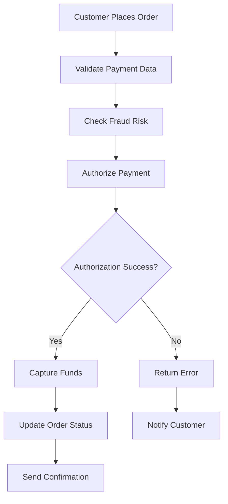
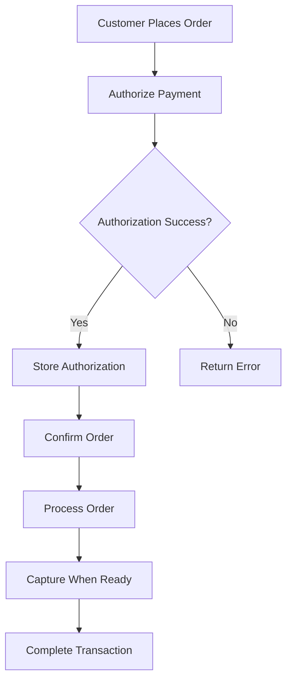
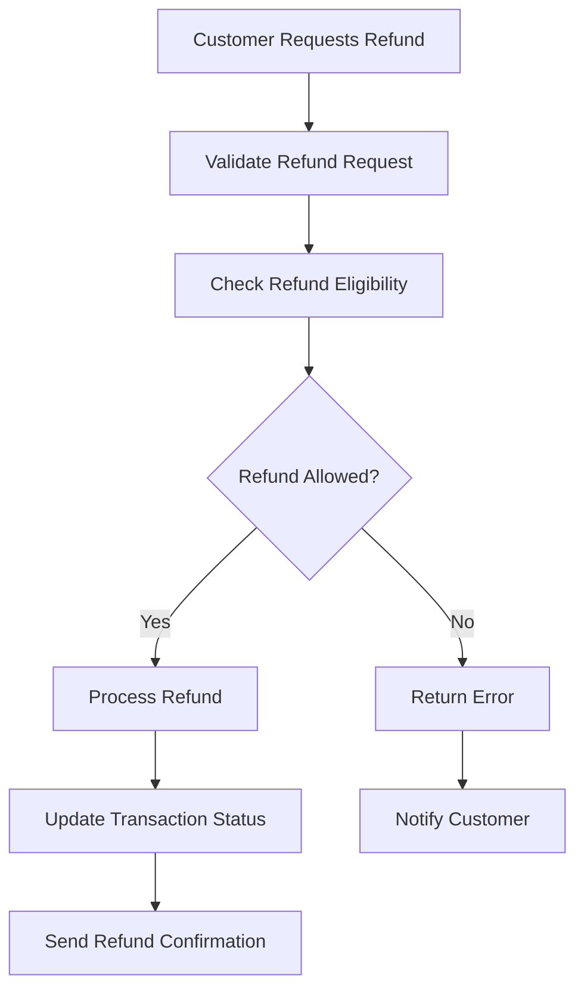

# Payment Transactions and Workflows Guide

## Overview

This guide covers payment transaction processing workflows, including authorization, capture, refunds, and cancellations using the Authorize.net API.

## Table of Contents
1. [Transaction Types](#transaction-types)
2. [Payment Workflows](#payment-workflows)
3. [API Implementation](#api-implementation)
4. [Error Handling](#error-handling)
5. [Testing Scenarios](#testing-scenarios)
6. [Best Practices](#best-practices)

## Transaction Types

### 1. Authorization + Capture (Sale)
**Single-step transaction that authorizes and captures funds immediately.**

**Use Cases:**
- E-commerce purchases
- Immediate payment processing
- Standard online transactions

**Workflow:**
1. Validate payment data
2. Authorize payment with Authorize.net
3. Capture funds immediately
4. Update transaction status
5. Send confirmation

### 2. Authorization Only
**Authorize funds without capturing them.**

**Use Cases:**
- Pre-authorization
- Hotel bookings
- Rental car reservations
- Delayed capture scenarios

**Workflow:**
1. Validate payment data
2. Authorize payment with Authorize.net
3. Store authorization details
4. Return authorization response
5. Capture later when needed

### 3. Prior Authorization Capture
**Capture previously authorized funds.**

**Use Cases:**
- Completing pre-authorized transactions
- Fulfilling orders
- Service completion

**Workflow:**
1. Validate capture request
2. Capture authorized funds
3. Update transaction status
4. Send confirmation

### 4. Refund
**Return funds to customer's payment method.**

**Use Cases:**
- Product returns
- Service cancellations
- Partial refunds
- Full refunds

**Workflow:**
1. Validate refund request
2. Check refund eligibility
3. Process refund with Authorize.net
4. Update transaction status
5. Send confirmation

### 5. Void
**Cancel transaction before settlement.**

**Use Cases:**
- Order cancellations
- Error corrections
- Pre-settlement cancellations

**Workflow:**
1. Validate void request
2. Check void eligibility
3. Void transaction with Authorize.net
4. Update transaction status
5. Send confirmation

## Payment Workflows

### Standard E-commerce Flow



### Pre-authorization Flow



### Refund Flow



## API Implementation

### Payment Service Class

```python
import asyncio
import aiohttp
from typing import Dict, Any, Optional
from datetime import datetime
from enum import Enum

class TransactionType(Enum):
    AUTH_CAPTURE = "authCaptureTransaction"
    AUTH_ONLY = "authOnlyTransaction"
    PRIOR_AUTH_CAPTURE = "priorAuthCaptureTransaction"
    REFUND = "refundTransaction"
    VOID = "voidTransaction"

class PaymentService:
    def __init__(self, api_login_id: str, transaction_key: str, 
                 base_url: str = "https://apitest.authorize.net/xml/v1/request.api"):
        self.api_login_id = api_login_id
        self.transaction_key = transaction_key
        self.base_url = base_url
        self.session = None
    
    async def __aenter__(self):
        self.session = aiohttp.ClientSession()
        return self
    
    async def __aexit__(self, exc_type, exc_val, exc_tb):
        if self.session:
            await self.session.close()
    
    async def create_payment(self, payment_data: Dict[str, Any]) -> Dict[str, Any]:
        """Create a new payment (authorize + capture)."""
        return await self._process_transaction(
            TransactionType.AUTH_CAPTURE, payment_data
        )
    
    async def authorize_payment(self, payment_data: Dict[str, Any]) -> Dict[str, Any]:
        """Authorize payment without capturing."""
        return await self._process_transaction(
            TransactionType.AUTH_ONLY, payment_data
        )
    
    async def capture_payment(self, auth_code: str, amount: float) -> Dict[str, Any]:
        """Capture previously authorized payment."""
        capture_data = {
            "amount": str(amount),
            "refTransId": auth_code
        }
        return await self._process_transaction(
            TransactionType.PRIOR_AUTH_CAPTURE, capture_data
        )
    
    async def refund_payment(self, transaction_id: str, amount: Optional[float] = None) -> Dict[str, Any]:
        """Refund a payment."""
        refund_data = {
            "refTransId": transaction_id
        }
        if amount:
            refund_data["amount"] = str(amount)
        
        return await self._process_transaction(
            TransactionType.REFUND, refund_data
        )
    
    async def void_payment(self, transaction_id: str) -> Dict[str, Any]:
        """Void a payment."""
        void_data = {
            "refTransId": transaction_id
        }
        return await self._process_transaction(
            TransactionType.VOID, void_data
        )
    
    async def _process_transaction(self, transaction_type: TransactionType, 
                                 data: Dict[str, Any]) -> Dict[str, Any]:
        """Process transaction with Authorize.net."""
        request_data = {
            "createTransactionRequest": {
                "merchantAuthentication": {
                    "name": self.api_login_id,
                    "transactionKey": self.transaction_key
                },
                "transactionRequest": {
                    "transactionType": transaction_type.value,
                    **data
                }
            }
        }
        
        async with self.session.post(
            self.base_url,
            json=request_data,
            headers={"Content-Type": "application/json"}
        ) as response:
            return await response.json()
```

### Transaction Workflow Manager

```python
from dataclasses import dataclass
from typing import Optional
from enum import Enum

class TransactionStatus(Enum):
    PENDING = "pending"
    AUTHORIZED = "authorized"
    CAPTURED = "captured"
    REFUNDED = "refunded"
    VOIDED = "voided"
    FAILED = "failed"

@dataclass
class Transaction:
    id: str
    merchant_id: str
    amount: float
    currency: str
    status: TransactionStatus
    payment_method: Dict[str, Any]
    authorize_net_transaction_id: Optional[str] = None
    authorization_code: Optional[str] = None
    created_at: datetime
    updated_at: datetime

class TransactionWorkflowManager:
    def __init__(self, payment_service: PaymentService, database):
        self.payment_service = payment_service
        self.database = database
    
    async def process_payment(self, payment_data: Dict[str, Any]) -> Transaction:
        """Process a complete payment workflow."""
        # Create transaction record
        transaction = await self._create_transaction(payment_data)
        
        try:
            # Process payment with Authorize.net
            result = await self.payment_service.create_payment(payment_data)
            
            # Update transaction based on result
            if result.get("transactionResponse", {}).get("responseCode") == "1":
                transaction.status = TransactionStatus.CAPTURED
                transaction.authorize_net_transaction_id = result["transactionResponse"]["transId"]
            else:
                transaction.status = TransactionStatus.FAILED
            
            # Save transaction
            await self._save_transaction(transaction)
            
            return transaction
            
        except Exception as e:
            transaction.status = TransactionStatus.FAILED
            await self._save_transaction(transaction)
            raise e
    
    async def process_authorization(self, payment_data: Dict[str, Any]) -> Transaction:
        """Process authorization-only workflow."""
        transaction = await self._create_transaction(payment_data)
        
        try:
            result = await self.payment_service.authorize_payment(payment_data)
            
            if result.get("transactionResponse", {}).get("responseCode") == "1":
                transaction.status = TransactionStatus.AUTHORIZED
                transaction.authorization_code = result["transactionResponse"]["transId"]
            else:
                transaction.status = TransactionStatus.FAILED
            
            await self._save_transaction(transaction)
            return transaction
            
        except Exception as e:
            transaction.status = TransactionStatus.FAILED
            await self._save_transaction(transaction)
            raise e
    
    async def capture_authorization(self, transaction_id: str, amount: float) -> Transaction:
        """Capture previously authorized transaction."""
        transaction = await self._get_transaction(transaction_id)
        
        if transaction.status != TransactionStatus.AUTHORIZED:
            raise ValueError("Transaction must be authorized to capture")
        
        try:
            result = await self.payment_service.capture_payment(
                transaction.authorization_code, amount
            )
            
            if result.get("transactionResponse", {}).get("responseCode") == "1":
                transaction.status = TransactionStatus.CAPTURED
                transaction.amount = amount
            else:
                transaction.status = TransactionStatus.FAILED
            
            await self._save_transaction(transaction)
            return transaction
            
        except Exception as e:
            transaction.status = TransactionStatus.FAILED
            await self._save_transaction(transaction)
            raise e
    
    async def refund_transaction(self, transaction_id: str, amount: Optional[float] = None) -> Transaction:
        """Refund a transaction."""
        transaction = await self._get_transaction(transaction_id)
        
        if transaction.status != TransactionStatus.CAPTURED:
            raise ValueError("Transaction must be captured to refund")
        
        try:
            result = await self.payment_service.refund_payment(
                transaction.authorize_net_transaction_id, amount
            )
            
            if result.get("transactionResponse", {}).get("responseCode") == "1":
                transaction.status = TransactionStatus.REFUNDED
            else:
                transaction.status = TransactionStatus.FAILED
            
            await self._save_transaction(transaction)
            return transaction
            
        except Exception as e:
            transaction.status = TransactionStatus.FAILED
            await self._save_transaction(transaction)
            raise e
    
    async def void_transaction(self, transaction_id: str) -> Transaction:
        """Void a transaction."""
        transaction = await self._get_transaction(transaction_id)
        
        if transaction.status not in [TransactionStatus.AUTHORIZED, TransactionStatus.PENDING]:
            raise ValueError("Transaction must be authorized or pending to void")
        
        try:
            result = await self.payment_service.void_payment(
                transaction.authorize_net_transaction_id
            )
            
            if result.get("transactionResponse", {}).get("responseCode") == "1":
                transaction.status = TransactionStatus.VOIDED
            else:
                transaction.status = TransactionStatus.FAILED
            
            await self._save_transaction(transaction)
            return transaction
            
        except Exception as e:
            transaction.status = TransactionStatus.FAILED
            await self._save_transaction(transaction)
            raise e
    
    async def _create_transaction(self, payment_data: Dict[str, Any]) -> Transaction:
        """Create new transaction record."""
        return Transaction(
            id=f"txn_{int(datetime.now().timestamp())}",
            merchant_id=payment_data["merchant_id"],
            amount=float(payment_data["amount"]),
            currency=payment_data["currency"],
            status=TransactionStatus.PENDING,
            payment_method=payment_data["payment_method"],
            created_at=datetime.now(),
            updated_at=datetime.now()
        )
    
    async def _get_transaction(self, transaction_id: str) -> Transaction:
        """Get transaction from database."""
        # Implementation here
        pass
    
    async def _save_transaction(self, transaction: Transaction):
        """Save transaction to database."""
        # Implementation here
        pass
```

## Error Handling

### Transaction Error Types

```python
class TransactionError(Exception):
    def __init__(self, message: str, error_code: str, transaction_id: str = None):
        self.message = message
        self.error_code = error_code
        self.transaction_id = transaction_id
        super().__init__(message)

class AuthorizationError(TransactionError):
    pass

class CaptureError(TransactionError):
    pass

class RefundError(TransactionError):
    pass

class VoidError(TransactionError):
    pass

class TransactionErrorHandler:
    def __init__(self):
        self.error_mappings = {
            "2": "Transaction declined",
            "3": "Transaction error",
            "4": "Transaction held for review",
            "5": "Transaction failed",
            "6": "Invalid card number",
            "7": "Invalid expiration date",
            "8": "Invalid CVV",
            "9": "Invalid amount",
            "10": "Invalid currency"
        }
    
    def handle_authorize_net_error(self, response: Dict[str, Any]) -> TransactionError:
        """Handle Authorize.net error response."""
        transaction_response = response.get("transactionResponse", {})
        response_code = transaction_response.get("responseCode")
        
        if response_code == "1":
            return None  # Success
        
        error_code = transaction_response.get("errors", [{}])[0].get("errorCode", "unknown")
        error_text = transaction_response.get("errors", [{}])[0].get("errorText", "Unknown error")
        
        if response_code == "2":
            return AuthorizationError(f"Transaction declined: {error_text}", error_code)
        elif response_code == "3":
            return TransactionError(f"Transaction error: {error_text}", error_code)
        elif response_code == "4":
            return TransactionError(f"Transaction held for review: {error_text}", error_code)
        else:
            return TransactionError(f"Transaction failed: {error_text}", error_code)
```

## Testing Scenarios

### Unit Tests

```python
import pytest
from unittest.mock import AsyncMock, patch
from payment_service import PaymentService, TransactionWorkflowManager

@pytest.fixture
def payment_service():
    return PaymentService("test_login", "test_key")

@pytest.fixture
def workflow_manager(payment_service):
    return TransactionWorkflowManager(payment_service, None)

@pytest.mark.asyncio
async def test_successful_payment(payment_service):
    """Test successful payment processing."""
    with patch('aiohttp.ClientSession.post') as mock_post:
        mock_response = AsyncMock()
        mock_response.json.return_value = {
            "transactionResponse": {
                "responseCode": "1",
                "transId": "40000000001",
                "authCode": "AUTH123"
            }
        }
        mock_post.return_value.__aenter__.return_value = mock_response
        
        payment_data = {
            "amount": "100.00",
            "payment": {
                "creditCard": {
                    "cardNumber": "4111111111111111",
                    "expirationDate": "1225",
                    "cardCode": "123"
                }
            }
        }
        
        result = await payment_service.create_payment(payment_data)
        
        assert result["transactionResponse"]["responseCode"] == "1"
        assert result["transactionResponse"]["transId"] == "40000000001"

@pytest.mark.asyncio
async def test_declined_payment(payment_service):
    """Test declined payment processing."""
    with patch('aiohttp.ClientSession.post') as mock_post:
        mock_response = AsyncMock()
        mock_response.json.return_value = {
            "transactionResponse": {
                "responseCode": "2",
                "errors": [{
                    "errorCode": "6",
                    "errorText": "The credit card number is invalid."
                }]
            }
        }
        mock_post.return_value.__aenter__.return_value = mock_response
        
        payment_data = {
            "amount": "100.00",
            "payment": {
                "creditCard": {
                    "cardNumber": "4000000000000002",
                    "expirationDate": "1225",
                    "cardCode": "123"
                }
            }
        }
        
        result = await payment_service.create_payment(payment_data)
        
        assert result["transactionResponse"]["responseCode"] == "2"
        assert "invalid" in result["transactionResponse"]["errors"][0]["errorText"]

@pytest.mark.asyncio
async def test_authorization_workflow(workflow_manager):
    """Test authorization-only workflow."""
    payment_data = {
        "merchant_id": "merchant_123",
        "amount": 100.00,
        "currency": "USD",
        "payment_method": {
            "type": "card",
            "card": {
                "number": "4111111111111111",
                "expiry_date": "12/25",
                "cvv": "123"
            }
        }
    }
    
    with patch.object(workflow_manager.payment_service, 'authorize_payment') as mock_auth:
        mock_auth.return_value = {
            "transactionResponse": {
                "responseCode": "1",
                "transId": "40000000001"
            }
        }
        
        transaction = await workflow_manager.process_authorization(payment_data)
        
        assert transaction.status == TransactionStatus.AUTHORIZED
        assert transaction.authorization_code == "40000000001"
```

### Integration Tests

```python
@pytest.mark.asyncio
async def test_complete_payment_workflow():
    """Test complete payment workflow from authorization to capture."""
    async with PaymentService("test_login", "test_key") as service:
        # Authorize payment
        auth_data = {
            "amount": "100.00",
            "payment": {
                "creditCard": {
                    "cardNumber": "4111111111111111",
                    "expirationDate": "1225",
                    "cardCode": "123"
                }
            }
        }
        
        auth_result = await service.authorize_payment(auth_data)
        assert auth_result["transactionResponse"]["responseCode"] == "1"
        
        auth_code = auth_result["transactionResponse"]["transId"]
        
        # Capture payment
        capture_result = await service.capture_payment(auth_code, 100.00)
        assert capture_result["transactionResponse"]["responseCode"] == "1"
```

## Best Practices

### 1. Transaction Management
- Always validate input data before processing
- Use idempotency keys to prevent duplicate transactions
- Implement proper error handling and logging
- Store transaction state consistently

### 2. Security
- Never store card data in plain text
- Use tokenization for sensitive data
- Implement proper authentication and authorization
- Log all transaction events for audit

### 3. Performance
- Use async/await for I/O operations
- Implement connection pooling
- Cache frequently accessed data
- Monitor transaction processing times

### 4. Error Handling
- Classify errors by type and severity
- Implement retry logic for transient errors
- Provide clear error messages to users
- Log errors with sufficient context

### 5. Testing
- Test all transaction types and workflows
- Include error scenarios in tests
- Use mock services for external dependencies
- Implement comprehensive integration tests

## Common Issues and Solutions

### Issue: Duplicate Transactions
- **Cause**: Lack of idempotency handling
- **Solution**: Implement idempotency keys and duplicate detection

### Issue: Authorization Expired
- **Cause**: Delayed capture beyond authorization window
- **Solution**: Implement proper authorization management and notifications

### Issue: Partial Refunds
- **Cause**: Incorrect refund amount calculation
- **Solution**: Track refund amounts and validate against original transaction

### Issue: Transaction State Inconsistency
- **Cause**: Race conditions in state updates
- **Solution**: Use database transactions and proper locking mechanisms

## Next Steps

1. Review [Customer Profiles Guide](06-customer-profiles.md)
2. Learn about [Fraud Management](07-fraud-management.md)
3. Implement [Fault Tolerance](08-fault-tolerance.md)
4. Set up [Performance Monitoring](09-performance-optimization.md)

## Resources

- [Authorize.net API Reference](https://developer.authorize.net/api/reference/)
- [Payment Processing Best Practices](https://stripe.com/docs/payments)
- [PCI DSS Compliance](https://www.pcisecuritystandards.org/)
- [Transaction Processing Patterns](https://microservices.io/patterns/data/transactional-outbox.html)
